# Sunburn

# Update Schedule

The Sunburn packages will update minor versions after every new significant feature.
Patches address bug fixes.
To use the UI with the most recent commit, even if the commit hasn't been bundled in a release, visit [rolling.sunburn.gg](https://rolling.sunburn.gg).

# Get Started

The goal of this guide is to set up a minimal Sunburn instance with basic text chat, voice calls, and screen sharing. We will set up a server with some public and some private channels.

I will be using Coolify (and therefore Traefik) as a reverse proxy. There are a few manual labels that must be applied to the LiveKit container, so you may need to figure out the equivalent for your reverse proxy.

The frontend must be served over SSL (or set the Chrome flag `#unsafely-treat-insecure-origin-as-secure`) for the `MediaDevices` API (microphone, camera, screenshare) to work.

> [!NOTE]
> Sunburn is still in early development. It is not very user-friendly yet. There are several features missing in the UI.

This guide assumes working knowledge of the Linux command line and Docker.

## Install

### Prepare

You will need to set 3 records on a domain pointing at your server.
1. Where your users should go to access Sunburn. I'm using `docs.sunburn.gg` --> `3000`.
2. Where your LiveKit server will live. I'm using `docs-rtc.sunburn.gg` --> `7880`.
3. Another domain pointing at your LiveKit server that we'll use for the TURN server. I'm using `docs-rtc-turn.sunburn.gg` --> `5349`. **Note that users will be connecting on layer 4 to this hostname, so if you're using Cloudflare/similar, make sure to NOT proxy this record.**

LiveKit has [excellent docs on self-hosting](https://docs.livekit.io/transport/self-hosting/) for those who want to explore alternate configurations.

### Sunburn

Run `sunburnco/sunburn:latest` from either [Docker Hub](https://hub.docker.com/r/sunburnco/sunburn) or the [GitHub Container Registry](https://github.com/sunburnco/sunburn/pkgs/container/sunburn). This container needs persistent storage in `/data`, and exposes port `3000`.

Environment variables:
- `CLEAN_SOFT_DELETES_AFTER`: how many days to hold on to soft-deleted records. `0` to keep all soft deletes
- `LIVEKIT_API_KEY`: starts with `APIK...`
- `LIVEKIT_API_SECRET`: the other one
- `LIVEKIT_BASE_URL`: the address of your LiveKit server (2nd record)
- `USER_DEFAULT_MAX_SERVERS`: how many servers (terminology below) each user is allowed to create by default. `-1` to disable. I recommend `0` if you have any untrusted users on your instance

```
# .env
CLEAN_SOFT_DELETES_AFTER=14
LIVEKIT_API_KEY=APIK...
LIVEKIT_API_SECRET=changeme
LIVEKIT_BASE_URL=https://docs-rtc.sunburn.gg
USER_DEFAULT_MAX_SERVERS=0
```

### LiveKit

Run `livekit/livekit-server:latest` (available on Docker Hub). We only need to expose port `5349`, but we'll also need to pass in a config file to `/etc/livekit.yaml`, then run the server with the `command` `--config /etc/livekit.yaml`.

We also must set up the reverse proxy to expect traffic on layer 4. I did that, along with TLS termination, with the `traefik.*` labels below.

```yaml
# livekit.yaml
port: 7880 # management API
bind_addresses:
    - ""
rtc:
    tcp_port: 7881
    port_range_start: 0
    port_range_end: 0
    use_external_ip: false
    enable_loopback_candidate: false
turn:
    enabled: true
    domain: docs-rtc-turn.sunburn.gg # changeme
    tls_port: 5349
    udp_port: 3478
    external_tls: true
keys:
    APIK<openssl rand -hex 28>: <openssl rand -hex 32> # changeme
webhook:
  api_key: 'APIK...' # generated above
  urls:
    - 'https://docs.sunburn.gg/lkwebhook' # changeme
```

### Docker Compose

**The router name (`traefik.tcp.routers.NAME`) must be unique for all LiveKit servers running behind your reverse proxy.** Ask me how I know.

```yaml
services:
  sunburn:
    image: 'sunburnco/sunburn:latest'
    restart: unless-stopped
    expose:
      - '3000'
    volumes:
      - './files/pb_data:/data'
    environment:
      - 'CLEAN_SOFT_DELETES_AFTER=${CLEAN_SOFT_DELETES_AFTER}'
      - 'LIVEKIT_API_KEY=${LIVEKIT_API_KEY}'
      - 'LIVEKIT_API_SECRET=${LIVEKIT_API_SECRET}'
      - 'LIVEKIT_BASE_URL=${LIVEKIT_BASE_URL}'
      - 'USER_DEFAULT_MAX_SERVERS=${USER_DEFAULT_MAX_SERVERS}'
  livekit:
    image: 'livekit/livekit-server:latest'
    command: '--config /etc/livekit.yaml'
    restart: unless-stopped
    volumes:
      - './files/livekit.yaml:/etc/livekit.yaml'
    expose:
      - '5349'
    labels:
      - coolify.enable=true
      - traefik.enable=true
      - traefik.tcp.routers.lkdocs.rule=HostSNI(`docs-rtc-turn.sunburn.gg`)
      - traefik.tcp.routers.lkdocs.entrypoints=https
      - traefik.tcp.routers.lkdocs.tls=true
      - traefik.tcp.routers.lkdocs.tls.certresolver=letsencrypt
      - traefik.tcp.routers.lkdocs.service=lkdocs
      - traefik.tcp.services.lkdocs.loadbalancer.server.port=5349
```

## Configure

On first launch, PocketBase will check for a superuser, then prompt creation of a superuser user if it can't find one. Check your Sunburn container logs for a URL, making sure to change the hostname as appropriate.

```
Server started at http://0.0.0.0:3000
├─ REST API:  http://0.0.0.0:3000/api/
└─ Dashboard: http://0.0.0.0:3000/_/
(!) Launch the URL below in the browser if it hasn't been open already to create your first superuser account:
http://0.0.0.0:3000/_/#/pbinstal/eyJhbGciOiJIUzI1...
(you can also create your first superuser by running: ./sunburn superuser upsert EMAIL PASS)
```

In my case, I'm going to `https://docs.sunburn.gg/_/#/pbinst...`

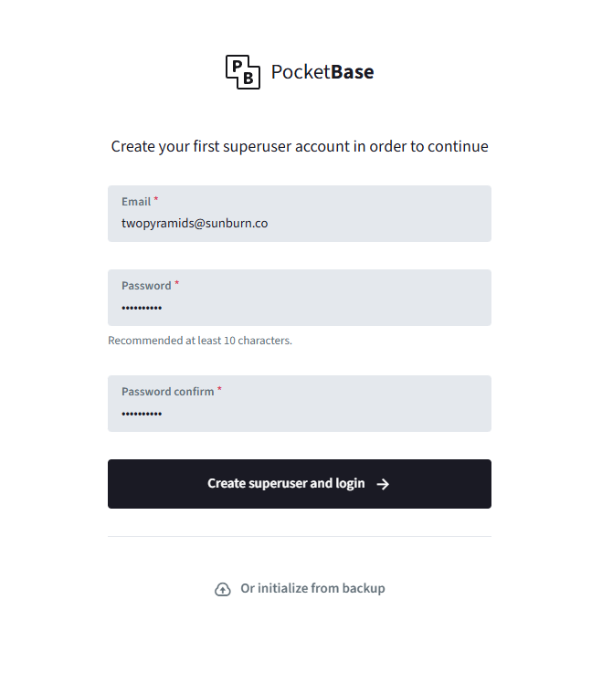

Once you're done, you should be in the dashboard.

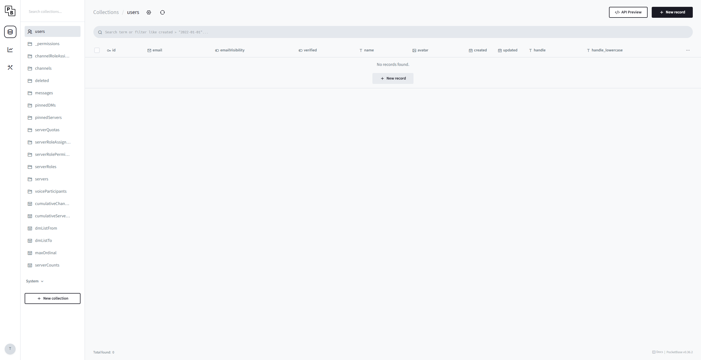

Since the UI is still in early development, we'll need to do some manual setup in the dashboard before our users can start sending messages. In the future, everything will be configurable from the UI.

### Terminology

- An **instance** refers to a Docker container hosting Sunburn. 
- A **server** is a collection of channels; multiple servers exist on one instance.
- A **channel** is a collection of messages or a collection of WebRTC users; multiple channels exist in one server.

### Auth

By default, users are allowed to log in with their email or handle. You can add OAuth2 by editing the `users` collection.

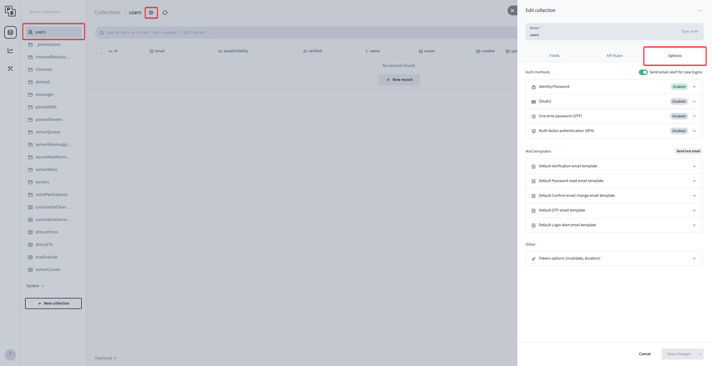

*Note that the Sunburn UI only supports Identity/Password and OAuth2. If you need 2FA, connect an OAuth2 provider, then configure 2FA on the provider. You can disable Identity/Password auth on the dashboard to force OAuth2.*

Begin by making yourself a user. You can reuse your email and/or your password from before **because you're making two different accounts; one to sign in to the dashboard, and one to sign in to Sunburn**. Avatars will render, but they are not configurable from the UI yet.

*You can disable user registration in the `users > API Rules` tab by clicking the "Create Rule" box until it says "superusers only."*

### Granular Permissions

I recently added granular permissions to Sunburn. Unfortunately, it's a lot of records to manually configure it, but thankfully, it's one-and-done.

There are two types of `_permissions`: server permissions and channel permissions.

- Each **server** has zero or more **roles** in the `serverRoles` collection
- Each role can have zero or more **permissions**, defined in the `serverRolePermissions` (srp) collection
- Every **user** on the **instance** can be assigned zero or more roles, defined in the `serverRoleAssignments` (sra) collection. This is how server membership is determined (note the `SERVER_MEMBER` `_permission`)
- Every **channel** can be assigned zero or more roles, defined in the `channelRoleAssignments` (cra) collection. This is how channel access is determined (note the `CHANNEL_READ` `_permission`)
- Use the `cumulative*Permissions` views when debugging permissions

Although the UI can't benefit from these permissions yet, there are fully functional API rules (PocketBase equivalent of row-level security) written around this permission system, and a full test suite for these rules in `backend/`.

Server owners have permanent admin permissions to their servers.

### The Good Stuff

Enough nerd talk. Let's set up a server with 3 channels: `#general`, `#ownerOnly`, and `#work`. Everyone should be allowed to access `#general`, but only people with the `employee` role should be allowed in `#work`. This guide is idential for voice channels; just enable the `voice` column.

Begin by making your userbase. I'm adding `alice` and `employeeBob`.

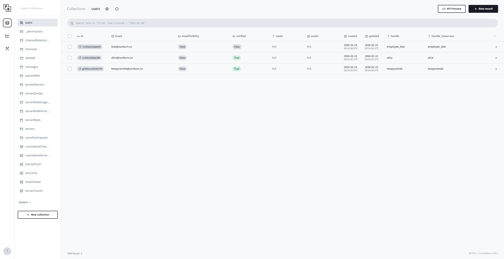

And we'll need a server. Make sure to set yourself as the owner.

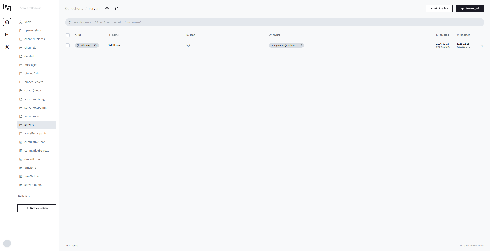

In the future, the UI will automatically create the `everyone` role with ordinal `0` and no permissions. It's not a hard requirement to have this role.

While we're here, let's also make the `employee` role. If you set a fractional ordinal, all other ordinals in the server will be rebalanced on insert.

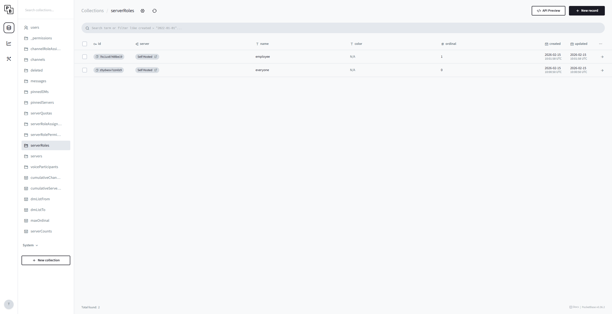

For now, let's just put `SERVER_MEMBER` on the `everyone` role using the `serverRolePermissions` collection.

Make the channels in the `channels` collection.

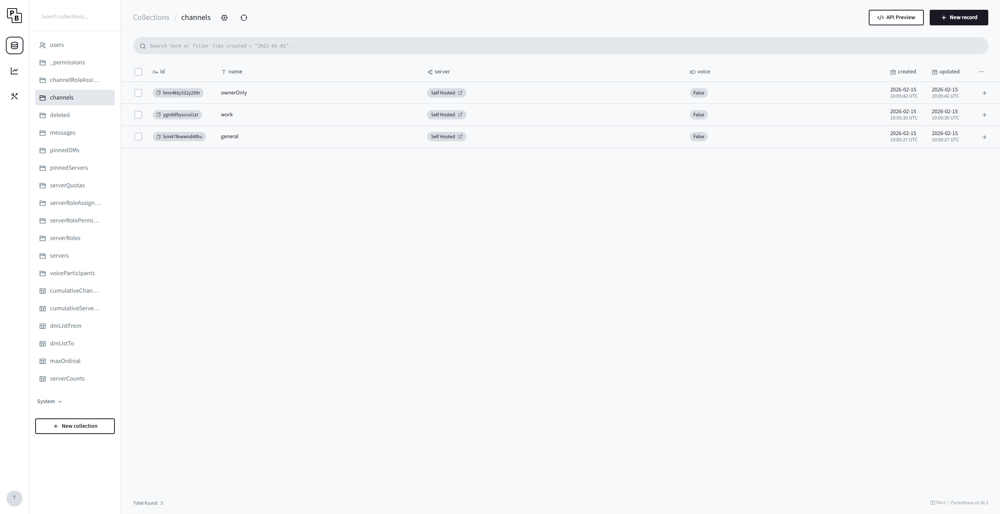

Let's go see what our users can see. In a new tab, go to your Sunburn instance's UI (the first domain) and log in with your email and password. Remember, you may have reused the email from the superuser account with a different password.

*I'm keeping my account `twopyramids` on the "day" theme, but Alice will be on "lilac" and Employee Bob will be on "oasis" for clarity.*

By default, the Sunburn UI tries to connect to the instance that's serving the HTML/CSS/JS. You can connect to any Sunburn instance by changing the instance URL.

My Sunburn instance is at `docs.sunburn.gg`

- `""` (empty string) --> `docs.sunburn.gg`
- `dundermifflin` --> `dundermifflin.on.sb`
- `dundermifflin:3000` --> `dundermifflin.on.sb:3000`
- `dundermifflin.` --> `dundermifflin` (internal DNS)
- `dundermifflin.:3000` --> `dundermifflin:3000` (internal DNS)
- `dundermifflin.com` --> `dundermifflin.com`
- `dundermifflin.com:3000` --> `dundermifflin.com:3000`

I'll just accept the default of `docs.sunburn.gg`. At this point, the Sunburn client will query for available auth methods. If you didn't disable email/password before, you'll see a form to log in with email and password. If you added OAuth2, you'll see a button to sign in with OAuth2.

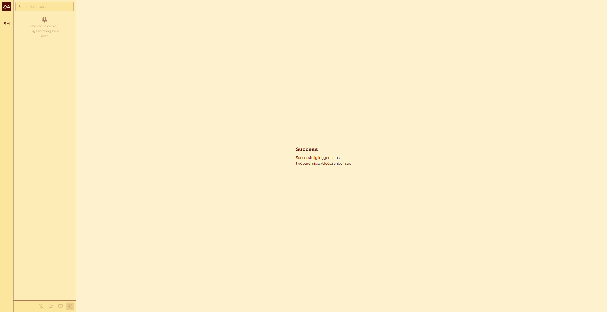

Notice how the server list auto-populated. The server list shows all the servers you have access to, across all instances.

Each server has all the channels we can access. As server owner, you have access to all channels.

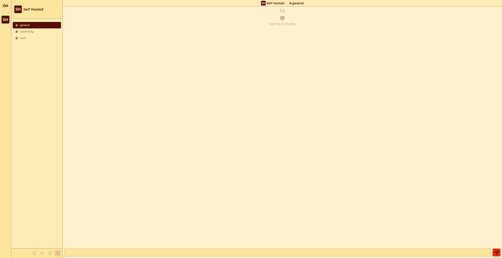

Alice doesn't have access to our server yet because she's not a member.

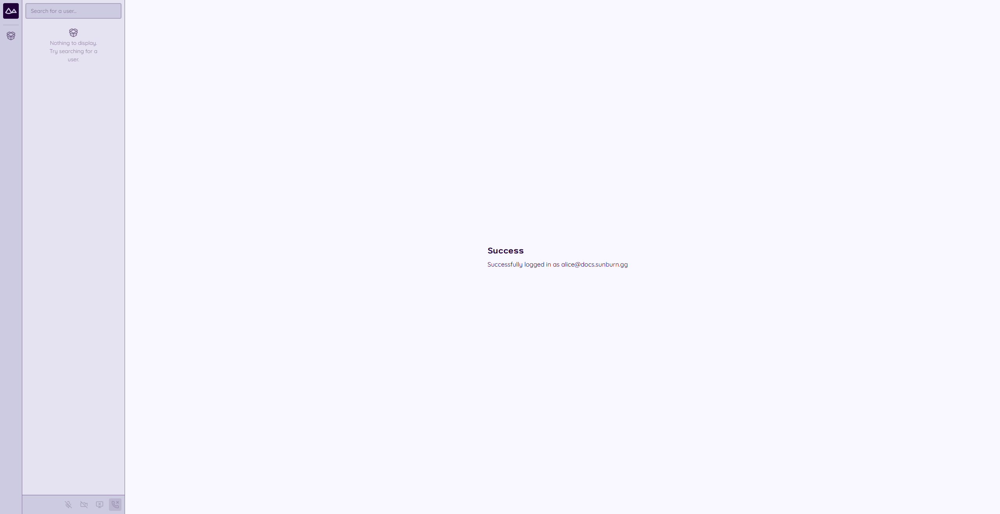

To give Alice membership, she needs a role with the `SERVER_MEMBER` permission. Since we gave `SERVER_MEMBER` to the `everyone` role earlier, we can just give Alice the `everyone` role and she'll become a member. Use the `serverRoleAssignments` table.

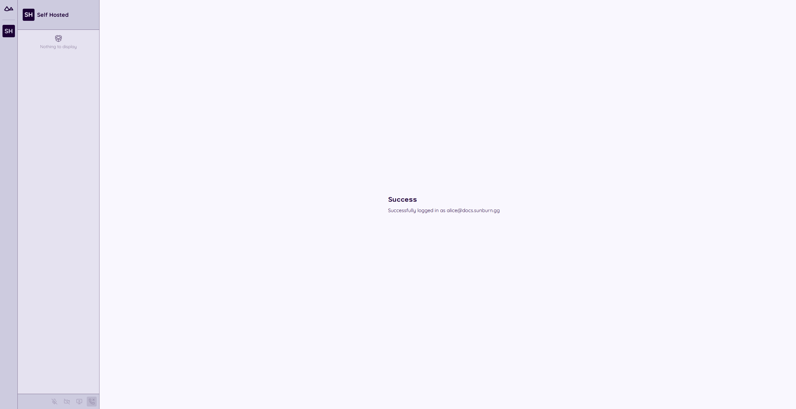

Unfortunately, she still has no access to any channels. We need to assign the `CHANNEL_READ` permission to `everyone` (`serverRolePermissions`), then assign the `everyone` role to `#general` (`channelRoleAssignments`).

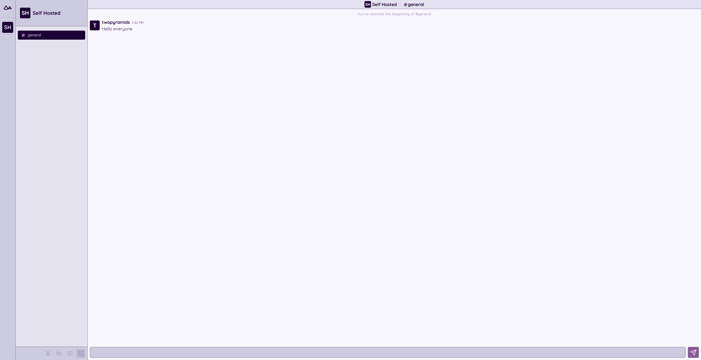

She still can't send messages, however, because the `everyone` role is missing the `CHANNEL_SEND` permission. Use the `serverRolePermissions` collection to add `CHANNEL_SEND` to `everyone`.

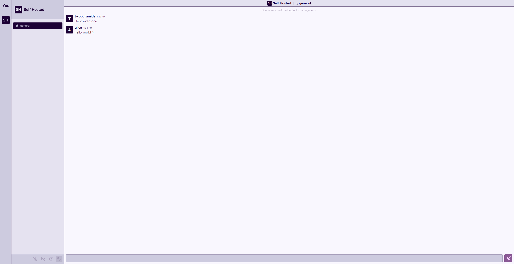

Now let's get Employee Bob set up. Bob needs the `everyone` role so he can get the `SERVER_MEMBER` permission. We'll also need to set the `employee` role to have `CHANNEL_READ` and `CHANNEL_SEND`, then assign the `employee` role to `#work`.

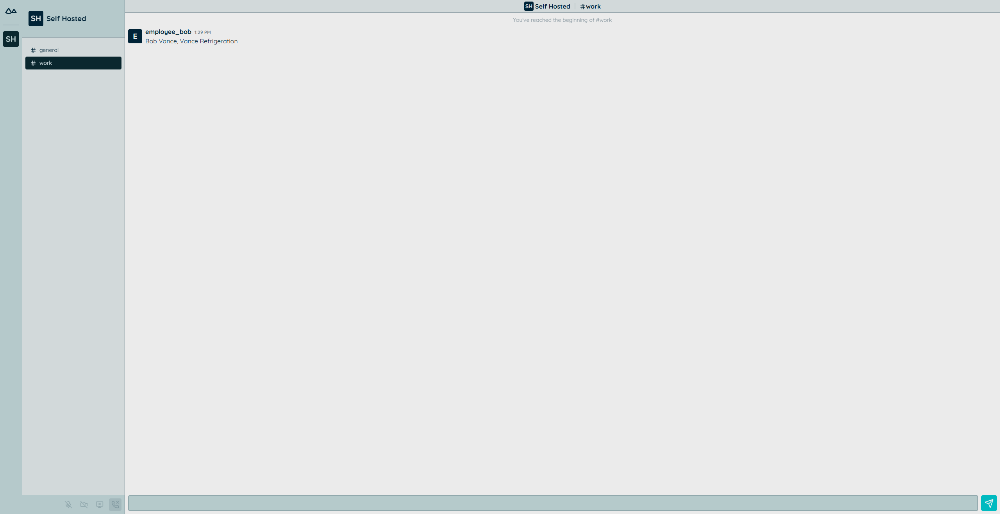

Finally, let's make a voice channel for everyone to talk in. Make a new channel with the `voice` column set to `true`.

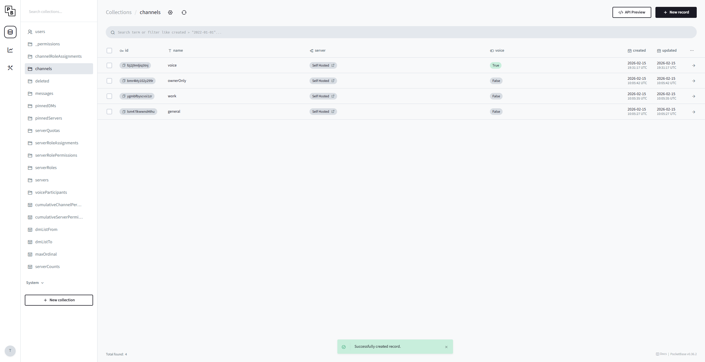

We'll add the `everyone` role to the channel, so if you can see `#general`, you can see `voice`.

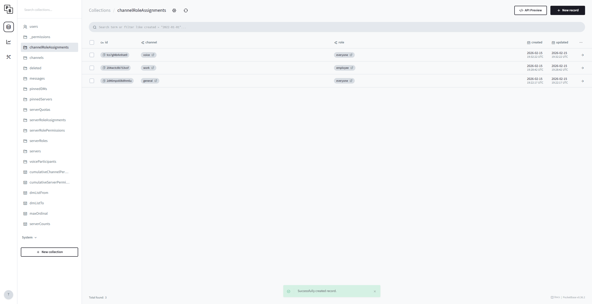

The frontend saves connection information in a key/value store, where the key is the instance URL. This means you can't use the same frontend for two accounts on the same instance URL.

- `alice@sunburn.gg` and `alice@docs.sunburn.gg`: good
- `alice@sunburn.gg` and `bob@sunburn.gg`: bad
- `alice@sunburn.gg` and `alice@sunburn-but-its-the-same-instance-behind-the-proxy.gg`: good

You can test two accounts on the same instance with one of these methods:

- Private browsing
- Browser profiles
- Use your frontend for `alice` and [sunburn.gg](https://sunburn.gg) for `bob`

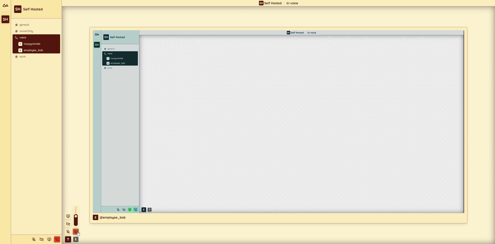

At this point, you should have a Sunburn instance configured with chat and video calling.
