# Sunburn

# Update Schedule

The Sunburn packages will update minor versions after every new significant feature.
Patches address bug fixes.
To use the UI with the most recent commit, even if the commit hasn't been bundled in a release, visit [rolling.sunburn.gg](https://rolling.sunburn.gg).

# Get Started

The goal of this guide is to set up a minimal Sunburn instance with basic text chat, voice calls, and screen sharing. We will set up a server with some public and some private channels.

I will be using Coolify (and therefore Traefik) as a reverse proxy. There are a few manual labels that must be applied to the LiveKit container, so you may need to figure out the equivalent for your reverse proxy.

The frontend must be served over SSL (or set the Chrome flag `#unsafely-treat-insecure-origin-as-secure`) for the `MediaDevices` API (microphone, camera, screenshare) to work.

> [!NOTE]
> Sunburn is still in early development. It is not very user-friendly yet. There are several features missing in the UI.

This guide assumes working knowledge of the Linux command line and Docker.

## Install

### Prepare

You will need to set 3 records on a domain pointing at your server.
1. Where your users should go to access Sunburn. I'm using `docs.sunburn.gg` --> `3000`.
2. Where your LiveKit server will live. I'm using `docs-rtc.sunburn.gg` --> `7880`.
3. Another domain pointing at your LiveKit server that we'll use for the TURN server. I'm using `docs-rtc-turn.sunburn.gg` --> `5349`. **Note that users will be connecting on layer 4 to this hostname, so if you're using Cloudflare/similar, make sure to NOT proxy this record.**

LiveKit has [excellent docs on self-hosting](https://docs.livekit.io/transport/self-hosting/) for those who want to explore alternate configurations.

### Sunburn

Run `sunburnco/sunburn:latest` from either [Docker Hub](https://hub.docker.com/r/sunburnco/sunburn) or the [GitHub Container Registry](https://github.com/sunburnco/sunburn/pkgs/container/sunburn). This container needs persistent storage in `/data`, and exposes port `3000`.

Environment variables:
- `CLEAN_SOFT_DELETES_AFTER`: how many days to hold on to soft-deleted records. `0` to keep all soft deletes
- `LIVEKIT_API_KEY`: starts with `APIK...`
- `LIVEKIT_API_SECRET`: the other one
- `LIVEKIT_BASE_URL`: the address of your LiveKit server (2nd record)
- `USER_DEFAULT_MAX_SERVERS`: how many servers (terminology below) each user is allowed to create by default. `-1` to disable. I recommend `0` if you have any untrusted users on your instance
- `SKIP_VERSION_CHECK`: `1` to skip the daily version check (not recommended)

```
# .env
CLEAN_SOFT_DELETES_AFTER=14
LIVEKIT_API_KEY=APIK...
LIVEKIT_API_SECRET=changeme
LIVEKIT_BASE_URL=https://docs-rtc.sunburn.gg
USER_DEFAULT_MAX_SERVERS=0
SKIP_VERSION_CHECK=0
```

### LiveKit

Run `livekit/livekit-server:v1.11` (available on Docker Hub). We only need to expose port `5349`, but we'll also need to pass in a config file to `/etc/livekit.yaml`, then run the server with the `command` `--config /etc/livekit.yaml`.

> [!NOTE]
> There seems to have been a regression in LiveKit's built-in TURN server with tag `v1.12` and later. I'm working on troubleshooting the problem.

> [!NOTE]
> Shoutout the LiveKit team for including `nc` in their containers so I could verify the `HostSNI` matching was working. I literally spent hours banging my head against the wall because I thought I was experiencing a routing issue from Traefik. Eventually, I had the idea to use `nc` to verify I could reach all the way through the proxy into the container.

We also must set up the reverse proxy to expect traffic on layer 4. I did that, along with TLS termination, with the `traefik.*` labels below.

```yaml
# livekit.yaml
port: 7880 # management API
bind_addresses:
    - "0.0.0.0" # new from last time
turn:
    enabled: true
    domain: docs-rtc-turn.sunburn.gg # changeme
    tls_port: 5349
    external_tls: true
keys:
    APIK<openssl rand -hex 16>: <openssl rand -hex 16> # changeme
webhook:
  api_key: 'APIK...' # generated above
  urls:
    - 'https://docs.sunburn.gg/api/sb/lkwebhook' # changeme
```

### Docker Compose

> [!NOTE]
> The router name (`traefik.tcp.routers.NAME`) must be unique for all LiveKit servers running behind your reverse proxy. Ask me how I know.

You can change the name of `traefik.tcp.routers.<routername>` and `traefik.tcp.services.<servicename>`. The important thing is to remember the penultimate line should be `traefik.tcp.routers.<routername>.service=<servicename>`.

```yaml
services:
  sunburn:
    image: 'sunburnco/sunburn:latest'
    restart: unless-stopped
    expose:
      - '3000'
    volumes:
      - './files/pb_data:/data'
    environment:
      - 'CLEAN_SOFT_DELETES_AFTER=${CLEAN_SOFT_DELETES_AFTER}'
      - 'LIVEKIT_API_KEY=${LIVEKIT_API_KEY}'
      - 'LIVEKIT_API_SECRET=${LIVEKIT_API_SECRET}'
      - 'LIVEKIT_BASE_URL=${LIVEKIT_BASE_URL}'
      - 'USER_DEFAULT_MAX_SERVERS=${USER_DEFAULT_MAX_SERVERS}'
      - 'SKIP_VERSION_CHECK=${SKIP_VERSION_CHECK}'
  livekit:
    image: 'livekit/livekit-server:latest'
    command: '--config /etc/livekit.yaml'
    restart: unless-stopped
    volumes:
      - './files/livekit.yaml:/etc/livekit.yaml'
    expose:
      - '5349'
    labels:
      - coolify.enable=true
      - traefik.enable=true
      - traefik.tcp.routers.lkdocs.rule=HostSNI(`docs-rtc-turn.sunburn.gg`)
      - traefik.tcp.routers.lkdocs.entrypoints=https
      - traefik.tcp.routers.lkdocs.tls=true
      - traefik.tcp.routers.lkdocs.tls.certresolver=letsencrypt
      - traefik.tcp.routers.lkdocs.service=lkdocs
      - traefik.tcp.services.lkdocs.loadbalancer.server.port=5349
```

## Configure

On first launch, PocketBase will check for a superuser, then prompt creation of a superuser user if it can't find one. Check your Sunburn container logs for a URL, making sure to change the hostname as appropriate.

```
Server started at http://0.0.0.0:3000
├─ REST API:  http://0.0.0.0:3000/api/
└─ Dashboard: http://0.0.0.0:3000/_/
(!) Launch the URL below in the browser if it hasn't been open already to create your first superuser account:
http://0.0.0.0:3000/_/#/pbinstal/eyJhbGciOiJIUzI1...
(you can also create your first superuser by running: ./sunburn superuser upsert EMAIL PASS)
```

In my case, I'm going to `https://docs.sunburn.gg/_/#/pbinst...`

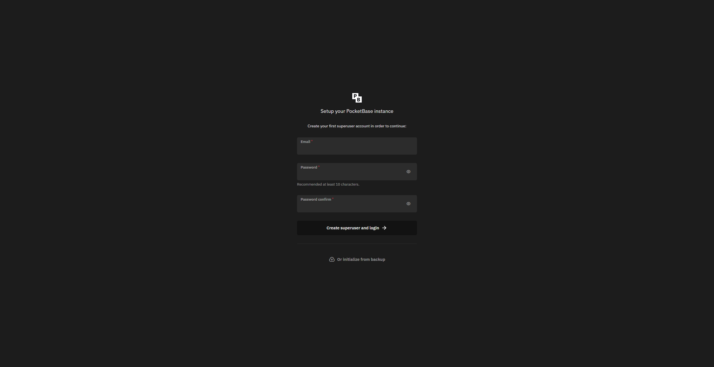

Once you're done, you should be in the dashboard.

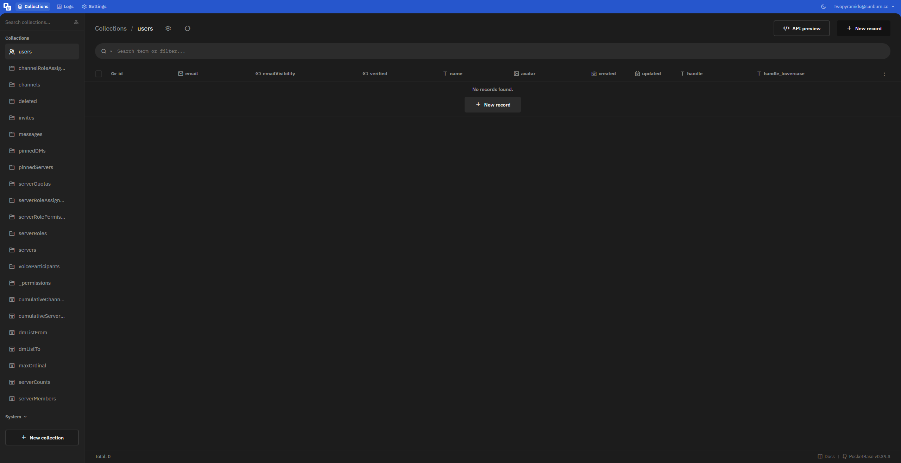

### Terminology

- An **instance** refers to a Docker container hosting Sunburn. 
- A **server** is a collection of channels; multiple servers exist on one instance.
- A **channel** is a collection of messages or a collection of WebRTC users; multiple channels exist in one server.

### Auth

By default, users are allowed to log in with their email or handle. You can add OAuth2 by editing the `users` collection.

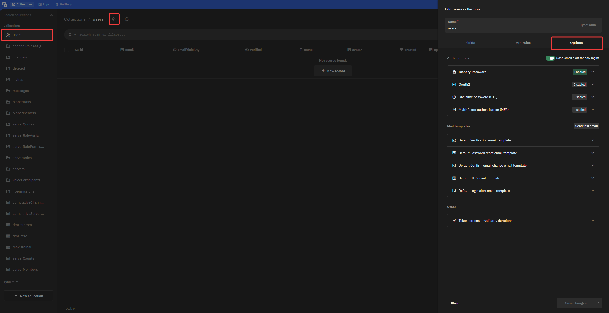

*Note that the Sunburn UI only supports Identity/Password and OAuth2. If you need 2FA, connect an OAuth2 provider, then configure 2FA on the provider. You can disable Identity/Password auth on the dashboard to force OAuth2.*

Begin by making yourself a user. You can reuse your email and/or your password from before **because you're making two different accounts; one to sign in to the dashboard, and one to sign in to Sunburn**. Avatars will render, but they are not configurable from the UI yet.

*You can disable user registration in the `users > API Rules` tab by clicking the "Create Rule" box until it says "superusers only."*

### Granular Permissions

There are two types of `_permissions`: server permissions and channel permissions.

- Each **server** has zero or more **roles** in the `serverRoles` collection
- Each role can have zero or more **permissions**, defined in the `serverRolePermissions` (srp) collection
- Every **user** on the **instance** can be assigned zero or more roles, defined in the `serverRoleAssignments` (sra) collection. This is how server membership is determined (note the `SERVER_MEMBER` `_permission`)
- Every **channel** can be assigned zero or more roles, defined in the `channelRoleAssignments` (cra) collection. This is how channel access is determined (note the `CHANNEL_READ` `_permission`)
- Use the `cumulative*Permissions` views when debugging permissions

There are fully functional API rules (PocketBase equivalent of row-level security) written around this permission system, and a full test suite for these rules in `backend/`.

Server owners have permanent admin permissions to their servers.

### The Good Stuff

Enough nerd talk. Let's set up a server with 3 channels: `#general`, `#ownerOnly`, and `#work`. Everyone should be allowed to access `#general`, but only people with the `employees` role should be allowed in `#work`.

Begin by making your userbase. I'm adding `alice` and `employeeBob`.

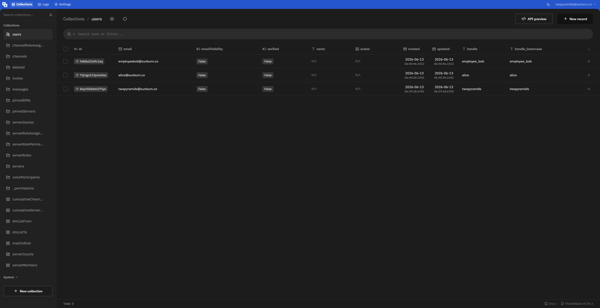

Now, we'll make a server. In a new tab, go to your Sunburn instance's UI (the first domain) and log in with your email and password. Remember, you may have reused the email from the superuser account with a different password.

*I'm keeping my account `twopyramids` on the "day" theme, but Alice will be on "lilac" and Employee Bob will be on "oasis" for clarity.*

By default, the Sunburn UI tries to connect to the instance that's serving the HTML/CSS/JS. You can connect to any Sunburn instance by changing the instance URL.

My Sunburn instance is at `docs.sunburn.gg`

- `""` (empty string) --> `docs.sunburn.gg`
- `dundermifflin` --> `dundermifflin.on.sb`
- `dundermifflin:3000` --> `dundermifflin.on.sb:3000`
- `dundermifflin.` --> `dundermifflin` (internal DNS)
- `dundermifflin.:3000` --> `dundermifflin:3000` (internal DNS)
- `dundermifflin.com` --> `dundermifflin.com`
- `dundermifflin.com:3000` --> `dundermifflin.com:3000`

I'll just accept the default of `docs.sunburn.gg`. At this point, the Sunburn client will query for available auth methods. If you didn't disable email/password before, you'll see a form to log in with email and password. If you added OAuth2, you'll see a button to sign in with OAuth2.

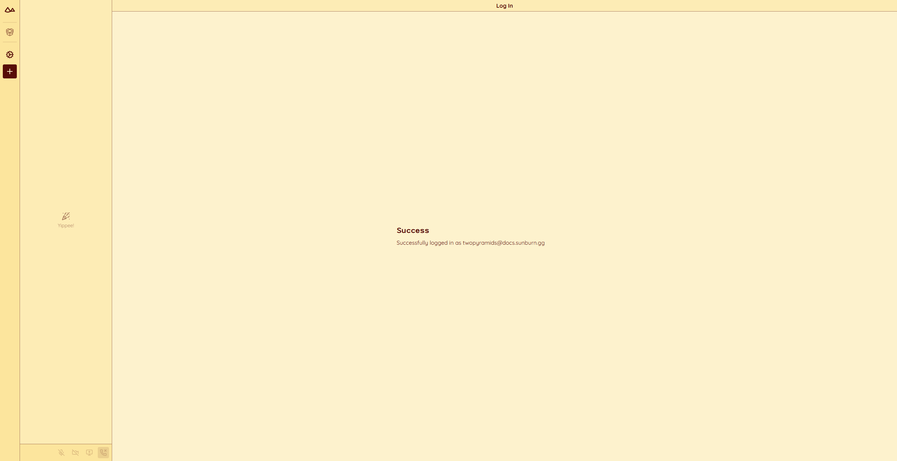

Make a new server by clicking the "+" button on the sidebar. I set `USER_DEFAULT_MAX_SERVERS` to `0`, so the option to create a server on `docs.sunburn.gg` is grayed out as I've already reached my quota. Head back to the dashboard and change the `serverQuotas` value for your user to a natural number, or `-1` for unlimited servers. Refresh the client to see the updated value.

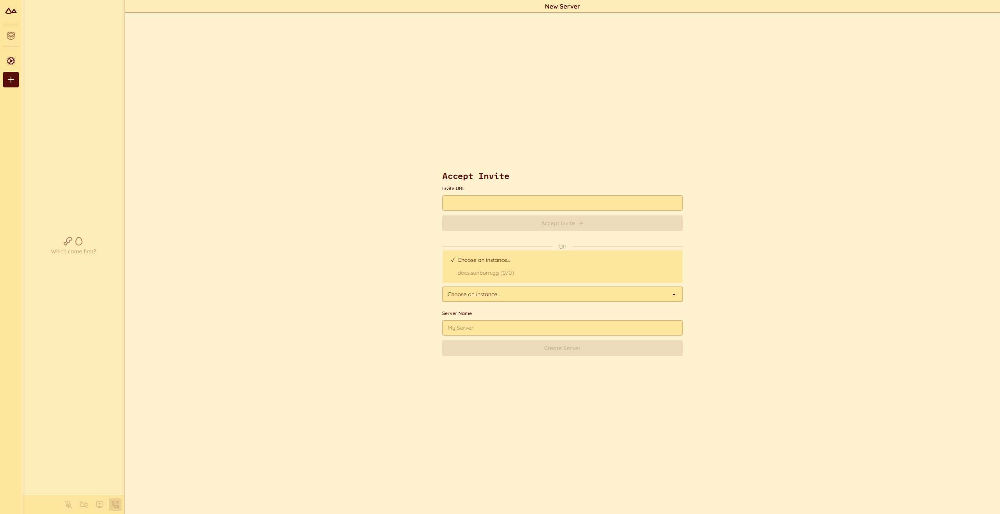

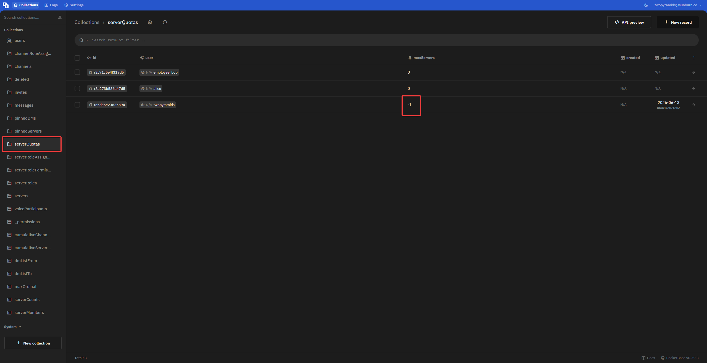

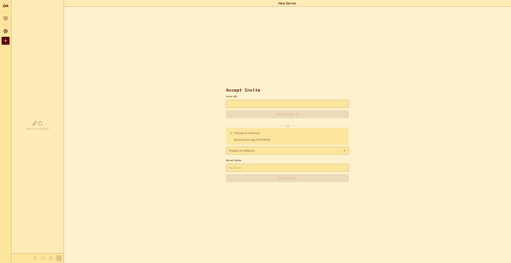

Notice how the server list auto-populated. The server list shows all the servers you have access to, across all instances.

Each server has all the channels we can access. As server owner, you have access to all channels.

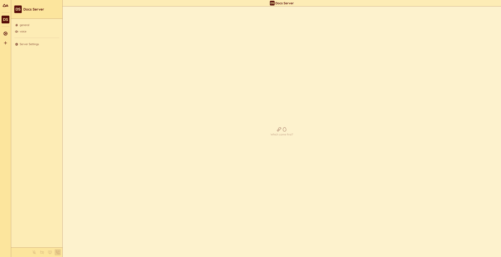

Alice doesn't have access to our server yet because she's not a member.

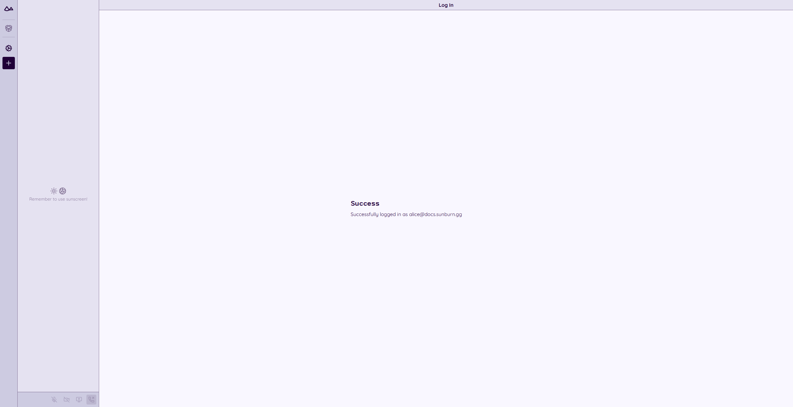

To give Alice membership, she needs to accept an invite to the server we just created. Use the "Server Settings" button below the channe list to create an invite.

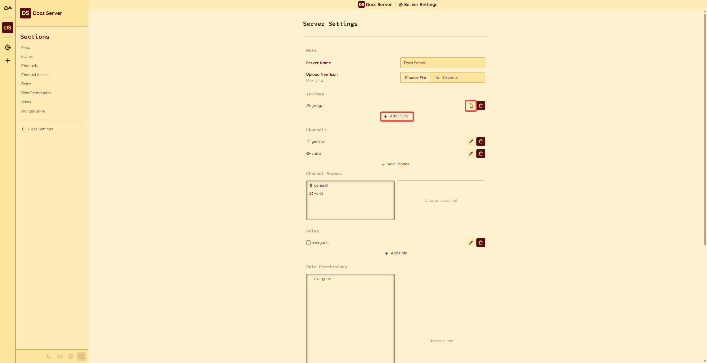

Alice must use the "+" button on the sidebar to accept the invite.

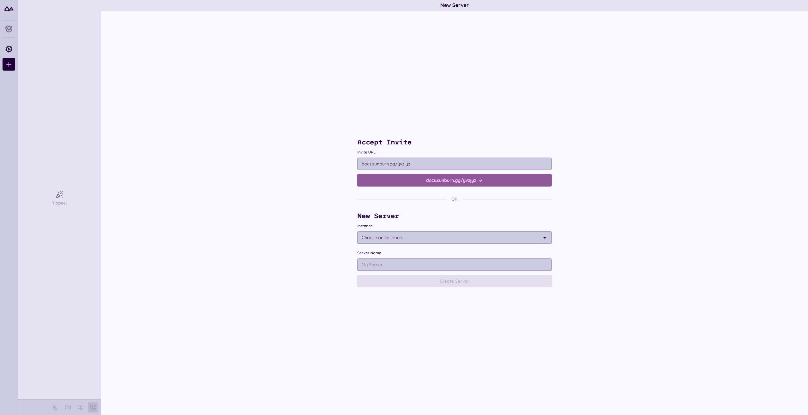

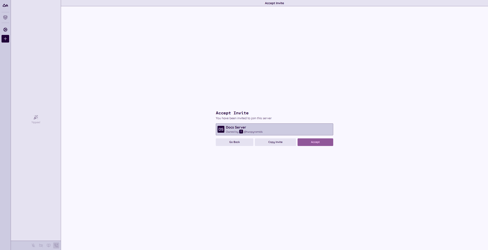

Alice is in! Repeat these steps with Bob to give him access.

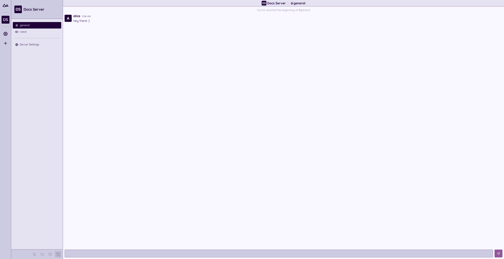

Let's make the other two channels: `#ownerOnly` and `#work`. I'm using the first account to access server settings and adding channels with the "+ Add Channel" button. Pending changes are marked in italic.

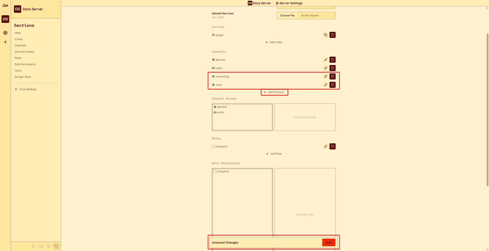

While we're at it, let's also make the `employees` role. Bob is a good employee, so I'm going to make the role green. Save the changes.

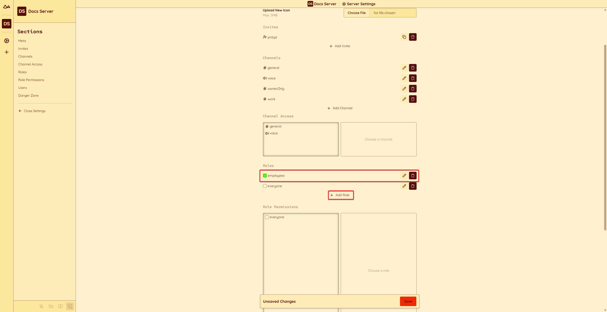

Now, we need to attach the new role to the `#work` channel so Bob can access `#work`. Choose `#work` in "Channel Access," then toggle on the `employees` role.

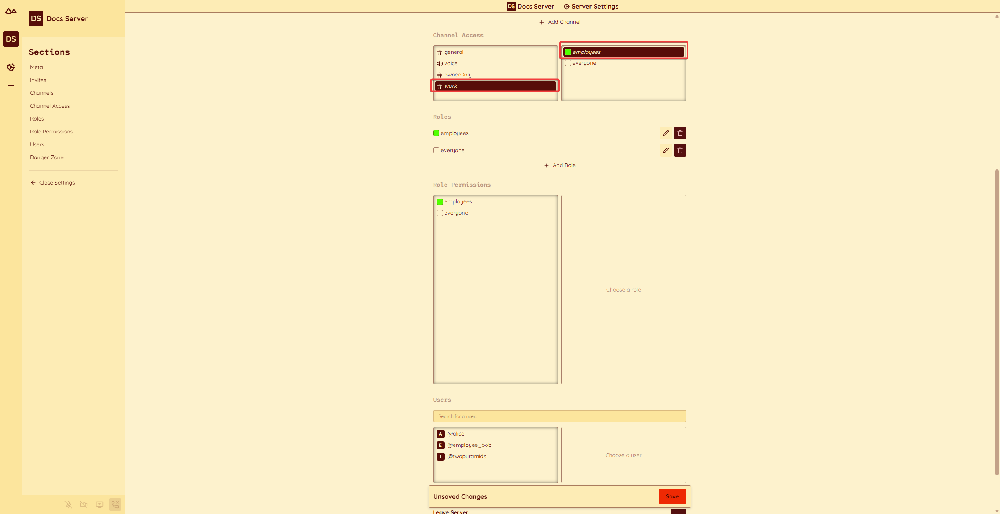

However, the role doesn't have permission to view the channels it's attached to. Select the `employees` role in "Role Permissions" and give it the `CHANNEL_READ` and `CHANNEL_SEND` permissions.

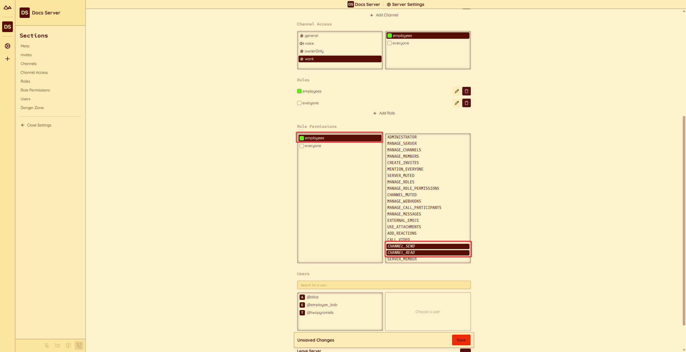

Finally, we need to assign the role to Bob by selecting him in the "Users" section and adding the `employees` role. Save the changes.

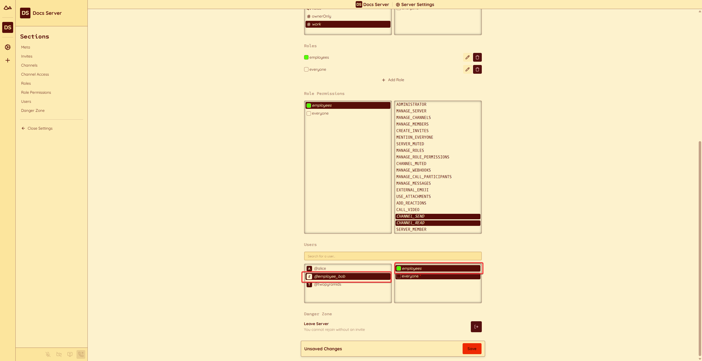

The server owner has access to all the channels, Employee Bob has access to `#work`, and Alice only has access to `#general`.

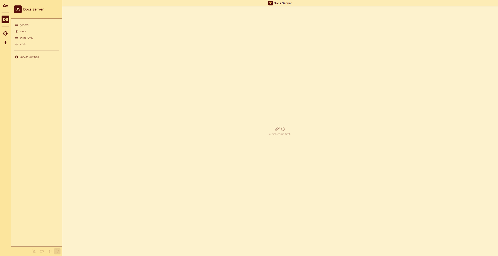

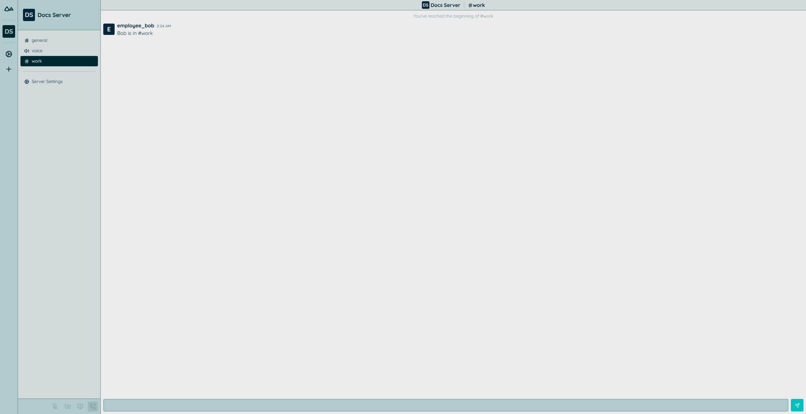

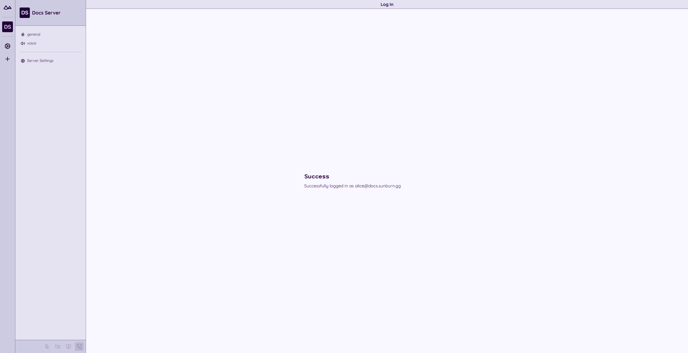

### Calling

You can also test to make sure calling is working. Here are some implementation and troubleshooting notes.

- In the above configuration, LiveKit hosts a TURN server at port 5349. Traefik uses its existing TCP connection at 443 to listen for a HostSNI match, then terminates the TLS and forwards the packets to the LiveKit container's port 5349. Therefore, the only port you need to have open if 443.
- You can verify Traefik is routing traffic appropriately by doing the following.
  1. Change `traefik.tcp.services.lkdocs.loadbalancer.server.port=` to be a new port (e.g. `15349`). Make sure to `expose` that port in the `docker-compose.yml`.
  2. In the container, run a `nc` server at the new port. For example, `nc -l -p 15349`.
  3. From another computer, initiate a TCP connection with `openssl s_client -connect docs-rtc-turn.sunburn.gg:443 -servername docs-rtc-turn.sunburn.gg` (change the hostname to match what you've been working on)
  4. Type a message and press Enter. You should see your message appear in the container's `nc` server.
- There seems to be a regression in LiveKit's TURN server with tag `v1.12`. `v1.11` works for me.
- You can use [LiveKit's connection tester](https://livekit.com/webrtc/connection-test) by generating a token with the following command: `lk --url https://docs-rtc.sunburn.gg --api-key APIK... --api-secret ... token create -r test -i conntest --valid-for 24h`, replacing `docs-rtc.sunburn.gg` with what you've been working on.

### A Note on Multiple Accounts

The frontend saves connection information in a key/value store, where the key is the instance URL. This means you can't use the same frontend for two accounts on the same instance URL.

- `alice@sunburn.gg` and `alice@docs.sunburn.gg`: good
- `alice@sunburn.gg` and `bob@sunburn.gg`: bad
- `alice@sunburn.gg` and `bob@sunburn-but-its-the-same-instance-behind-the-proxy.gg`: good

You can test two accounts on the same instance with one of these methods:

- Private browsing
- Browser profiles
- Use your frontend for `alice` and [sunburn.gg](https://sunburn.gg) for `employee_bob`
